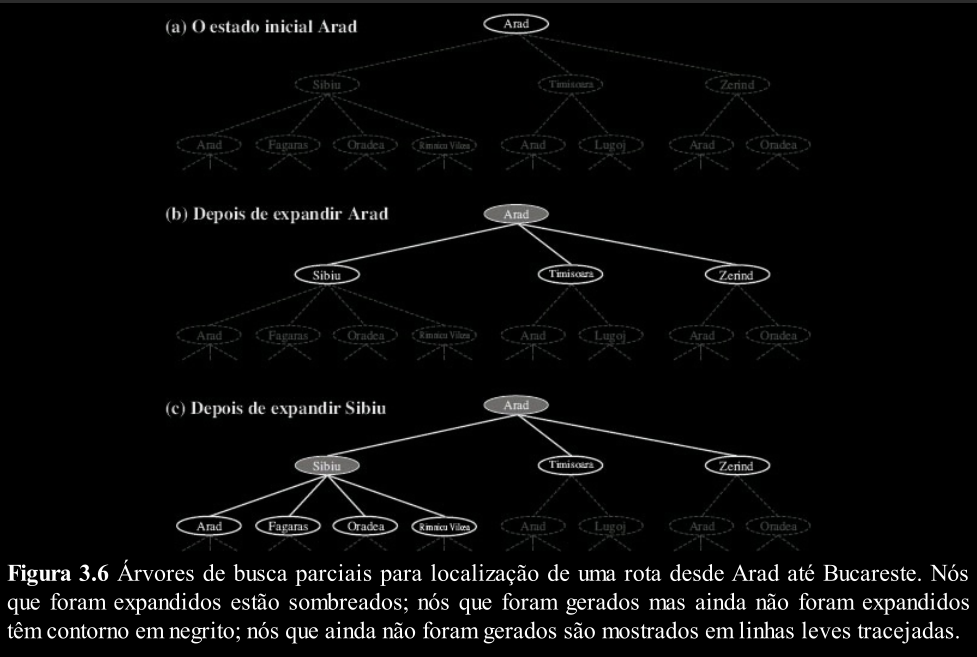
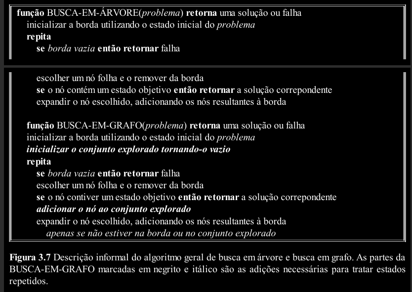
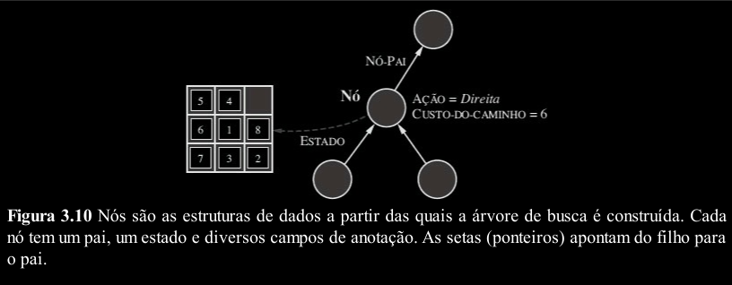

## Resolução de Problemas por meio de busca

> Aqui, vemos como um agente pode encontrar uma sequência de ações que alcança seus objetivos quando nenhuma ação isolada é capaz de fazê-lo.

Os agentes mais simples, são os agentes reativos, que baseiam suas ações em um mapeamento direto de estados em ações. Tais agentes não podem operar bem em ambientes para os quais esse mapeamento seria grande demais para se armazenar e levaria muito tempo para se aprender. Por outro lado, os agentes baseados em objetivos, consideram ações futuras e o quanto seus resultados são desejáveis.

Neste momento, vamos estudar um tipo de Agente baseado em Objetivos, chamado agente de Resolução de Problemas.

Os agentes de resolução de problemas utilizam representações atômicas, ou seja, os estados do mundo são considerados como um todo, sem estrutura interna visível para os algoritmos de resolução de problemas. 

Existem diversos algoritmos de busca, tanto busca sem informação (algoritmos para os quais não se fornece nenhuma informação sobre o problema a não ser sua definição), quanto de busca informada (algoritmos que possuem alguma orientação sobre onde procurar soluções).

Neste arquivo, nos limitaremos ao tipo mais simples de ambiente de tarefa, para o qual a solução
para um problema é sempre uma sequência fixa de ações. Em outros arquivos, veremos o caso mais geral, no qual as ações futuras do agente podem variar dependendo de percepções futuras.

---
## Agente de Resolução de Problemas

Os agentes inteligentes devem maximizar sua medida de desempenho.

Os objetivos ajudam a organizar o comportamento, limitando o que o agente está tentando alcançar e, consequentemente, as ações que ele precisa considerar. A formulação de objetivos, baseada na situação atual e na medida de desempenho do agente, é o primeiro passo para a resolução de problemas.

A formulação de problemas é o processo de decidir que ações e que estados devem ser considerados, dado um objetivo.

A tarefa do agente é descobrir como agir, agora e no futuro, para atingir o estado objetivo.

Suponha uma situação em que um Agente que viajar da cidada A até a cidade F. Não há um caminho direto de A para F, logo o agente terá que passar por outras cidades. A partir de A, existem duas estradas que levam para a cidade B e C, porém nenhuma delas é o estado objetivo (F). Se o agente não tiver nenhuma informação adicional, ou seja, se o ambiente for desconhecido, ele não terá escolha a não ser tentar uma das ações de forma aleatória. 

Porém, suponha que o agente tenha um mapa. O Agente pode usar essas informações para considerar estágios subsequentes de uma jornada hipotética, procurando descobrir um percurso que eventualmente chegue na cidade F.

Em geral, um agente com várias opções imediatas de valor desconhecido pode decidir o que fazer examinando primeiro ações futuras que levam eventualmente a estados de valor conhecido.

Para um ambiente observável, discreto, conhecido e determinístico, a solução para qualquer problema é sempre uma sequência fixa de ações. Se o agente souber o estado inicial e o ambiente for conhecido e determinístico, saberá exatamente onde estará após a primeira ação e o que vai perceber.

Esse processo de procurar por tal sequência de ações que alcançam o objetivo é chamado de busca.

Um algoritmo de busca recebe um problema como entrada e devolve uma solução sob a forma
de uma sequência de ações.

Desse modelo, temos o projeto de resolução "formular, buscar, executar".

Formulamos o problema, buscamos a sequência de ações que alcançam o objetivo e executamos essa sequência de ações.

---
## Formulando um Problema

Um problema pode ser definido formalmente por 5 componentes: 

- estado inicial em que o agente começa
- ações possíveis e disponíveis para o agente
- descrição do que cada ação faz
- teste do objetivo
- função de custo de caminho

Os elementos precedentes definem um problema e podem ser reunidos em uma única estrutura de
dados que é fornecida como entrada para um algoritmo de resolução de problemas. Uma solução
para um problema é um caminho desde o estado inicial até um estado objetivo. A qualidade da
solução é medida pela função de custo de caminho, e uma solução ótima tem o menor custo de
caminho entre todas as soluções.

Observe que divermos elementos de um problema foram omitidos. No exemplo de encontrar um caminho, omitimos a possibilidade da estrada estar bloqueada, por exemplo.

O processo de remover detalhes de uma representação é chamado de abstração.

---
## Buscando uma Solução

Uma solução é uma sequência de ações que levam ao estado objetivo. 

As sequências de ações possíveis formam uma árvore de busca, com o estado inicial sendo a raiz.

A partir da raiz, o primeiro passo é verificar se essa raiz é um estado objetivo. Não sendo, é necessário considerar a escolha de diversas ações. Isso é feito pela expansão do estado atual, ou seja, aplicando cada ação válida no estado atual, gerando assim um novo conjunto de estados.

Essa é a essência da busca, expandir e, caso não encontrar o estado objetivo, retroceder.

O conjunto de todos os nós folhas disponíveis para
expansão em um dado ponto é chamado de borda.

O Algoritmo de Busca em Grafo é idêntico ao de Busca em Árvore, porém o Grafo tem uma estrutura de dados que armazena todo nó que já foi expandido e armazena o conjunto explorado.

Para cada nó do grafo, temos uma estrutura que contém quatro componentes:

- Estado: o estado atual do grafo
- Pai: o nó pai do nó atual
- Ação: a ação que foi aplicada ao pai para gerar esse nó
- Custo do Caminho: o custo do estado inicial até esse nó

Até agora, não fomos muito cuidadosos na distinção entre nós e estados, mas ao escrever
algoritmos detalhados é importante fazer essa distinção. Um nó é uma anotação da estrutura de dados
usada para representar a árvore. Um estado corresponde a uma configuração do mundo.

Agora, que temos os nós, precisamos de um lugar para colocá-los. A borda precisa ser
armazenada de tal forma que o algoritmo de busca possa facilmente escolher o próximo nó para
expandir de acordo com sua estratégia preferida. A estrutura de dados apropriada para isso é uma
fila.

O conjunto explorado pode ser implementado com uma tabela hash para permitir um controle
eficaz de estados repetidos. Com uma boa implementação, a inserção e a busca podem ser realizadas
em tempos aproximadamente constantes.

---
## Medidas de Desempenho de uma Solução

• Completeza: O algoritmo oferece a garantia de encontrar uma solução quando ela existir?

• Otimização: A estratégia encontra a solução ótima, como definido na página 68?

• Complexidade de tempo: Quanto tempo ele leva para encontrar uma solução?

• Complexidade de espaço: Quanta memória é necessária para executar a busca?

---
