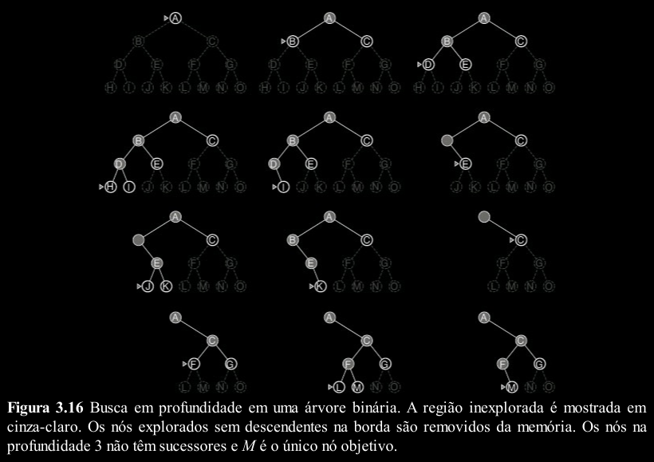

# Busca sem Informação

> Esta seção focaliza diversas estratégias de busca reunidas sob o título de busca sem informação
(também chamada busca cega).

> A expressão significa que elas não têm nenhuma informação
adicional sobre estados, além daquelas fornecidas na definição do problema. 

> Tudo o que elas podem
fazer é gerar sucessores e distinguir um estado objetivo de um estado não objetivo.

---
## Busca em Largura

A busca em largura (BrFS – Breadth-first search) é uma estratégia simples em que o nó raiz é
expandido primeiro, em seguida todos os sucessores do nó raiz são expandidos, depois os sucessores
desses nós, e assim por diante.

Todos os nós em dada profundidade na árvore de busca são
expandidos, antes que todos os nós no nível seguinte sejam expandidos.

A busca em largura é uma instância do algoritmo de busca em grafo.

Isso é conseguido simplesmente utilizando uma fila
FIFO para a borda. Assim, novos nós (que são sempre mais profundos do que seus pais) vão para o
fim da fila, e nós antigos, que são mais rasos que os novos, são expandidos primeiro.

---
## Busca em Profundidade

A busca em profundidade (DFS – Depth-first search) sempre expande o nó mais profundo na
borda atual da árvore de busca.

