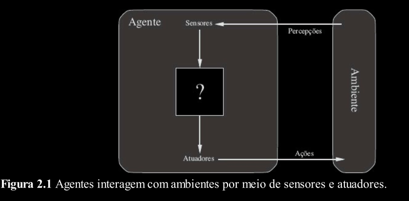

# Agente Inteligente

> Aqui, discutimos a natureza dos agentes, a diversidade de
ambientes e a consequente variedade de tipos de agentes.

---
## O que é um Agente?

Um agente é tudo o que pode ser considerado capaz de perceber seu ambiente por meio de
sensores e de agir sobre esse ambiente por intermédio de atuadores.

Um agente humano tem olhos, ouvidos e outros órgãos como sensores, e tem mãos,
pernas, boca e outras partes do corpo que servem como atuadores.

Um agente de software recebe sequências de teclas digitadas, conteúdo de arquivos e
pacotes de rede como entradas sensórias e atua sobre o ambiente exibindo algo na tela, escrevendo
em arquivos e enviando pacotes de rede.

Usamos o termo percepção para fazer referência às entradas do agente em um dado
instante. A sequência de percepções do agente é a história completa de tudo o que o agente já percebeu.

Em termos matemáticos, afirmamos que o
comportamento do agente é descrito pela função do agente que mapeia qualquer sequência de
percepções específica para uma ação.

A função de agente é uma descrição matemática abstrata; o
programa do agente é uma implementação concreta, executada em um sistema físico.

O mundo de aspirador de pó. Esse mundo é tão simples que podemos descrever tudo o que acontece. Esse mundo particular tem apenas dois locais: os quadrados A e B. O agente aspirador de pó percebe em que quadrado está e se existe sujeira no quadrado. Ele pode optar por mover-se para a esquerda, mover-se para a direita, aspirar a sujeira ou não fazer nada.

Uma função do agente muito simples é: se o quadrado
atual estiver sujo, então aspirar, caso contrário mover-se para o outro quadrado.

---
## Medida de Desempenho do Agente

Poderíamos propor medir o desempenho do agente de limpeza pela quantidade de sujeira aspirada. Um agente racional pode
maximizar essa medida de desempenho limpando a sujeira e, em seguida, despejando-a toda no chão,
depois limpando novamente, e assim por diante. 

Uma medida de desempenho mais apropriada
recompensaria o agente por deixar o chão limpo.

Como regra geral, é melhor projetar medidas de desempenho de acordo com o
resultado realmente desejado no ambiente, em vez de criá-las de acordo com o comportamento
esperado do agente.

---
## Racionalidade

A definição do que é racional em qualquer instante dado depende de quatro fatores:

- A medida de desempenho que define o critério de sucesso.
- O conhecimento prévio que o agente tem do ambiente.
- As ações que o agente pode executar.
- A sequência de percepções do agente até o momento.

Isso conduz a uma definição de um agente racional:
> Para cada sequência de percepções possível, um agente racional deve selecionar uma
ação que se espera venha a maximizar sua medida de desempenho, dada a evidência fornecida
pela sequência de percepções e por qualquer conhecimento interno do agente.

Ou seja, para dizermos se um agente é racional ou não, precisamos dizer o que é a medida de
desempenho, o que se conhece sobre o ambiente e quais são os sensores e atuadores que o agente
tem.

> Cuidado! Racionalidade não é o mesmo que perfeição. A racionalidade maximiza o
desempenho esperado, enquanto a perfeição maximiza o desempenho real.

Nossa definição exige um agente racional não apenas para coletar informações, mas também para
aprender tanto quanto possível a partir do que ele percebe.

Um agente racional deve ser autônomo. Ele
deve aprender o que puder para compensar um conhecimento prévio parcial ou incorreto.

