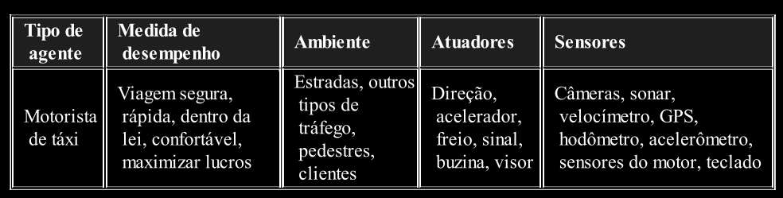
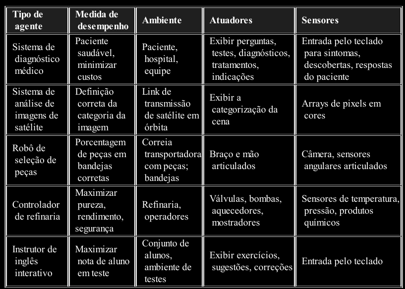
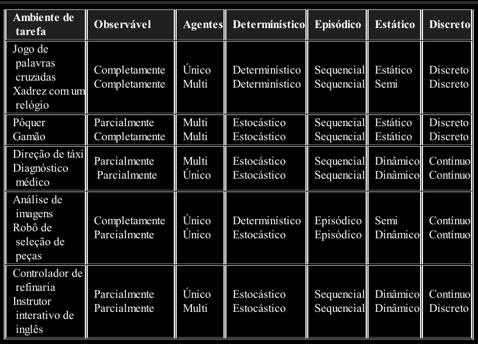

# Ambiente

> Agora estudaremos métodos para especificar os ambientes de trabalho dos agentes.

---
## Especificando o Ambiente de Tarefa

Um ambiente de tarefa é o conjunto formado pelos itens abaixo:

- Medida de Desempenho
- Atuadores do Agente
- Sensores do Agente
- Ambiente de atuação

Um Agente Motorista de Táxi, teria o seguinte ambiente de tarefa:

Veja outros exemplos de Ambientes de Tarefas para diferentes tipos de Agentes:

---
## Propriedades dos Ambientes de Tarefa

1. **Completamente Observável versus Parcialmente Observável**: 
    Se os sensores de um agente
permitem acesso ao estado completo do ambiente em cada instante, dizemos que o ambiente de tarefa
é completamente observável.

2. **Agente Único versus Multiagente**: 
    Essa distinção parece fácil e talvez realmente seja. Mas tem algo sutil. O Agente Motorista de Táxi, por exemplo, se ele encarar os outros motoristas como apenas entidades físicas, então ele é um agente único. Mas se ele encarar os outros motoristas como agentes, então estamos em um sistema multiagente. Além disso, o ambiente multiagente pode ser diferenciado entre Multiagente Cooperativo e Multiagente Competitivo.

3. **Determinístico versus Estocástico**: 
    Se o próximo estado do ambiente é completamente
determinado pelo estado atual e pela ação executada pelo agente, dizemos que o ambiente é
determinístico; caso contrário, ele é estocástico. Em princípio, um agente não precisa se preocupar
com a incerteza em um ambiente completamente observável e determinístico. A maioria das situações reais é tão complexa que é impossível acompanhar todos os
aspectos não observados; para finalidades práticas devem ser tratados como estocásticos.

4. **Episódico versus Sequencial**: 
    Em um ambiente de tarefa episódico, a experiência do agente é
dividida em episódios atômicos. Em cada episódio, o agente recebe uma percepção e em seguida
executa uma única ação. É crucial que o episódio seguinte não dependa das ações executadas em
episódios anteriores. Em ambientes episódicos, a escolha da ação em cada episódio só depende do
próprio episódio. Por outro lado, em ambientes sequenciais, a decisão atual poderia
afetar todas as decisões futuras.

5. **Estático versus Dinâmico**: 
    Se o ambiente puder se alterar enquanto um agente está deliberando,
dizemos que o ambiente é dinâmico para esse agente; caso contrário, ele é estático. 

6. **Discreto versus Contínuo**: 
    A distinção entre discreto e contínuo aplica-se ao estado do ambiente,
ao modo como o tempo é tratado, e ainda às percepções e ações do agente. Por exemplo, o xadrez
também tem um conjunto discreto de percepções e ações. Dirigir um táxi é um problema de estado
contínuo e tempo contínuo.

7. **Conhecido versus Desconhecido**: 
    Estritamente falando, essa distinção não se refere ao ambiente
em si, mas ao estado de conhecimento do agente sobre as regras do ambiente. Observe que a distinção entre os
ambientes conhecido e desconhecido não é a mesma que entre ambientes totalmente e parcialmente
observáveis. É perfeitamente possível para um ambiente conhecido ser parcialmente observável —
por exemplo, em jogos de cartas solitários, eu conheço as regras, mas sou incapaz de ver as cartas
que ainda não foram viradas.

Veja alguns exemplos de classificações dos ambientes:

