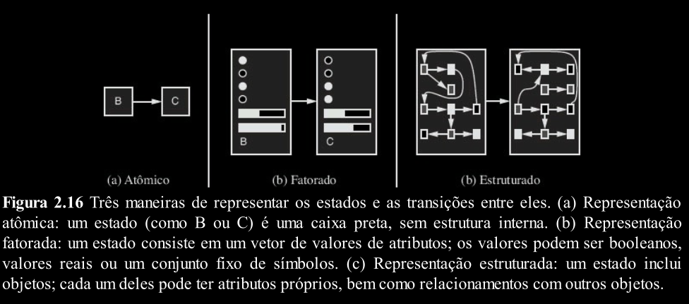

# Programa do Agente

> Como funcionam os componentes do programa de agente?

---

---
## Representação Atômica

Em uma representação atômica, cada estado do mundo é indivisível — não tem estrutura interna.

Um estado inicial e um estado final, apenas. Sem regras ou conhecimento prévio.

---
## Representação Fatorada

Uma representação fatorada divide cada estado em umconjunto fixo de variáveis ​ou atributos, cada um dos quais pode ter um valor.

Enquanto dois estados
atômicos diferentes não têm nada em comum — são apenas caixas pretas diferentes —, dois estados
fatorados diferentes podem compartilhar alguns atributos.

Com representações fatoradas, também se pode
representar a incerteza — por exemplo, a ignorância sobre a quantidade de combustível no tanque
pode ser representada deixando o atributo em branco.

---
## Representação Estruturada

Na representação estruturada, objetos e seus relacionamentos são explicitamente descritos.

