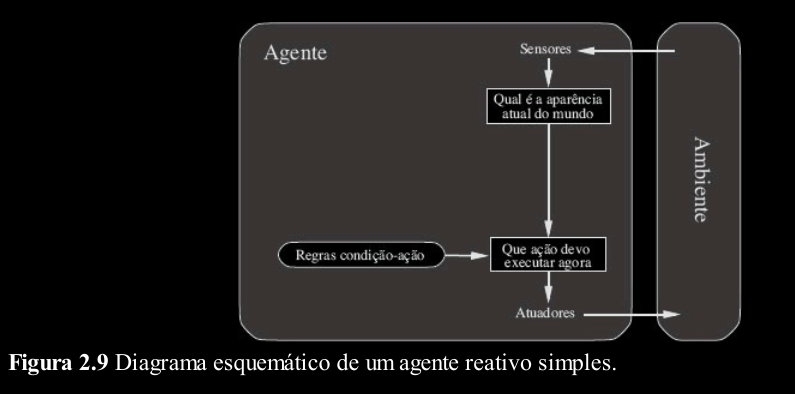
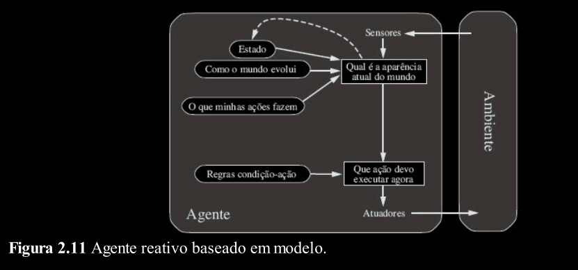
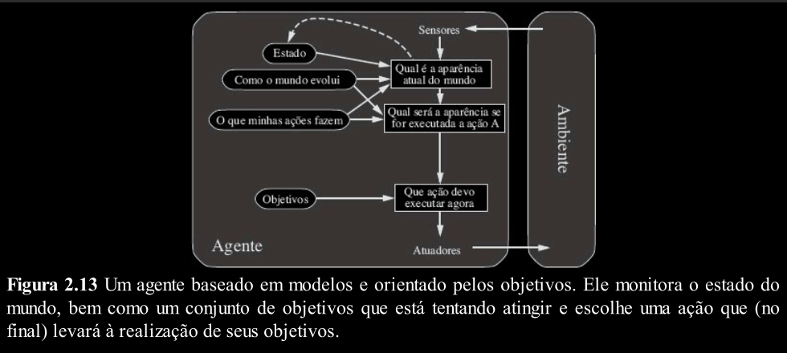
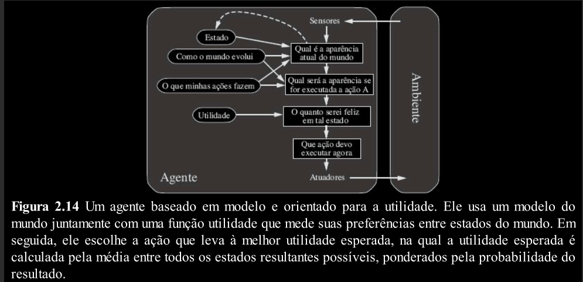
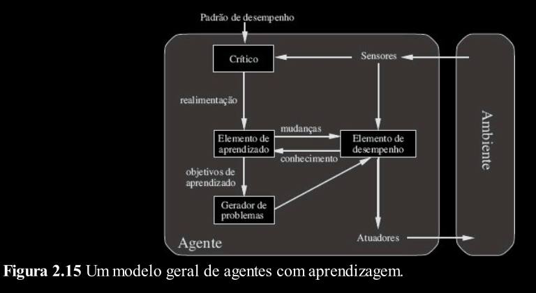

# Tipos de Agentes

> Aqui aprofundamos o conhecimento sobre Agentes e seus diferentes tipos

---
## Relembrando...

Até agora, fizemos referência aos agentes descrevendo-os apenas como entidades que percebem o ambiente por meio de sensores e atuam sobre este ambiente por meio de atuadores.

Agora, temos que seguir em frente e descrever o comportamento interno desses agentes.

O trabalho da IA é projetar o programa do agente que é a implementação concreta de sua função.

Esse programa do agente deve ser executado em um tipo de dispositivo de computação com sensores e atuadores.

> Agente = software + hardware

---
## Programa do Agente

> Lembre que a função do agente é apenas uma abstração matemática que mapeia percepções para ações.<br><br>
> O programa do agente é quem implementa essa função.

O programa do agente recebe apenas a
percepção atual como entrada; se as ações do
agente dependem da sequência de percepções inteira, o agente terá de memorizar as percepções.

Veja um exemplo em pseucódigo de uma função de Agente:
```python
def funcao_agente(percepcao) -> acao:
    List percepcoes # inicialmente vazia
    Dict tabela_acoes # percepcao -> acao

    percepcoes.append(percepcao)
    acao = tabela_acoes.getAcao(percepcao)
    return acao 
```

> A função acima é invocada para cada nova percepção
e retorna uma ação de cada vez. Ele mantém a sequência de percepções completas na memória.

A abordagem de construção de agentes orientados a tabelas é um fracasso. Em um mundo real, essas tabelas seriam enormes e, muitas vezes, infinitas. Nenhum agente físico teria espaço para armazenar essa tabela... fora o trabalho de construção.

O desafio fundamental da IA é descobrir como escrever programas que,
na medida do possível, produzam um comportamento racional a partir de um pequeno programa em
vez de uma grande tabela.

---
## Tipos de Agentes

> Neste tópico, estudaremos os diferentes tipos de Agentes:

> Reativo Simples<br>
> Reativo baseado em Modelo<br>
> Baseado em Objetivo<br>
> Baseado em Utilidade<br>
> Agente com Aprendizagem

---
### 1. Agente Reativo Simples

O tipo mais simples de agente é o agente reativo simples. Esses agentes selecionam ações com
base na percepção atual, ignorando o restante do histórico de percepções.

Por exemplo, o agente
aspirador de pó, é um agente reativo simples porque
sua decisão se baseia apenas na posição atual e no fato de essa posição conter ou não sujeira.

Os agentes reativos simples têm a admirável propriedade de serem simples, mas se caracterizam
por ter inteligência limitada.

O agente reativo simples funcionará somente se a decisão correta puder
ser tomada com base apenas na percepção 
atual, ou seja, apenas se o ambiente for completamente
observável. Até mesmo uma pequena impossibilidade de observação pode causar sérias
dificuldades.

```python
def agente_aspirador_reativo(posicao, sujeira) -> acao:
    if (sujeira):
        return Aspirar
    else:
        if (posicao == A) return B
        else return A
```

> Programa para um agente reativo simples no ambiente de aspirador.



---
### 2. Agente Reativo baseado em Modelo

Um agente reativo baseado em modelo pode lidar com ambientes parcialmente observáveis.

> O agente deve controlar as partes do mundo que ele não pode ver.

Para isso, o agente mantém um estado interno que armazena o histórico de percepções e reflita os aspectos não observados no estado atual.

Agente baseado em modelo é um agente que usa um modelo de mundo:

> Como o ambiente evolui independente do agente?

> Como as ações do agente afetam o mundo?

```python
def agente_reativo_baseado_modelo(percepcao) -> acao:
    String estado; #conhecimento do estado atual do ambiente
    String modelo; #uma descrição de como o próximo estado depende do estado atual;
    List regras; #um conjunto de regras condição-ação
    String acao; #a ação mais recente, inicialmente vazia

    estado = atualizar_estado(estado, percepcao, modelo, acao)
    
    regra = get_regra(estado, regras)
    
    acao = get_acao(regra, estado)
    return acao
```

> Um agente reativo baseado em modelo. Ele mantém o estado atual do mundo usando um
modelo interno. Em seguida, ele escolhe uma ação da mesma maneira que o agente reativo simples.

Independentemente do tipo de representação utilizada, raramente é possível para o agente
determinar exatamente o estado atual de um ambiente parcialmente observável. Em vez disso, a variável "estado" representa o "melhor palpite" do agente.

Conhecer um modelo do mundo nem sempre é suficiente para tomar uma boa decisão, exemplo:

> Um agente Motorista de Táxi chega a um cruzamento com três caminhos, qual direção tomar?

> Simplesmente reagir? mas existem três reações possíveis.

> Examinar o modelo de mundo? não ajuda a decidir qual o caminho.

> A decisão depende de onde o táxi está tentando chegar.



---
### 3. Agente baseado em Objetivos

Agentes baseados em objetivos expandem as capacidades dos agentes baseados em modelos através de um “objetivo”.

Os objetivos descrevem situações desejáveis.



A seleção da ação baseada em objetivo pode ser Direta ou Complexa.

Direta quando o resultado de uma única ação atinge o objetivo.

Complexa quando será necessário longas sequências de ações.

Para encontrar sequências de ações que alcançam os objetivos são utilizados algoritmos de Busca e Planejamento.

Note que a tomada de decisões desse tipo é fundamentalmente distinta das regras condição-ação
descritas anteriormente, pelo fato de envolver consideração do futuro, tanto de “O que acontecerá se
eu fizer isso e aquilo?” e “Isso me fará feliz?”. Nos projetos de agentes reativos, essas informações
não são representadas de forma explícita porque as regras internas fazem o mapeamento direto de
percepções para ações.

O agente que funciona orientado a objetivos é mais flexível do que um agente reativo.

Entretanto, o objetivo não garante o melhor comportamento para o agente, apenas a distinção entre estados objetivos e não objetivos.

---
### 4. Agente baseado em Utilidade

Agentes baseados na utilidade buscam definir um grau de satisfação com os estados. O quão “bom” é para o agente um determinado estado.

Se um estado do mundo é mais desejável que outro, então ele terá maior utilidade para o agente.

Utilidade é uma função que mapeia um estado para um número real que representa o grau de satisfação com este estado.



---
### 5. Agente com Aprendizagem

Agentes com aprendizado podem atuar em ambientes totalmente desconhecidos e se tornar mais eficientes do que o seu conhecimento inicial poderia permitir.


Em agentes sem aprendizagem, tudo o que o agente sabe foi colocado nele pelo projetista.



