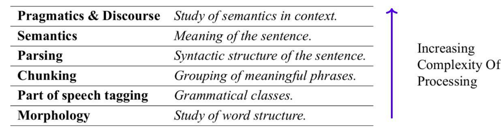
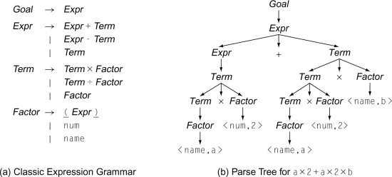

# Introdução

> O Processamento de Linguagem Natural (PLN) é um campo de pesquisa que tem como objetivo investigar e propor métodos de processamento computacional da linguagem humana.

---
## O que é uma Linguagem Natural?

Qualquer linguagem que tenha evoluído naturalmente entre os humanos por meio do uso e da repetição, sem planejamento consciente ou premeditação.

O adjetivo "Natural", na sigla, se refere às línguas faladas pelos humanos, distinguido-as das demais linguagens (matemáticas, gestuais, de programação...).

---
## Características de uma Linguagem Natural

1. Origem Humana Espontânea
2. Ambiguidade
3. Contextualidade
4. Regida por regras flexíveis
5. Evolução Contínua

---
## O que é PLN?

É um campo da computação, inteligência artificial e linguística computacional que se ocupa das interações entre computadores e as linguagens humanas (naturais).

---
## Contexto Histórico

1. Desafio de Turing
2. Estruturas Sintáticas, de Chomsky
3. Modelos de Linguagem
4. LLMs

---
## Desafios do Processamento da Linguagem Natural

Em PLN buscam-se soluções para problemas computacionais que requerem o tratamento de uma língua (português, inglês...), seja escrita ou falada. Línguas de sinais também têm sido alvo de estudos na área.

Recursos de fala, como a entonação, o volume, o sotaque, podem tanto aumentar a dificuldade do reconhecimento ou a síntese, como também facilitar o reconhecimento de sentimentos ou intenções do falante.

Vejas alguns desafios do Processamento de Linguagem Natural: 
1. Ambiguidade, tanto em textos como em imagens e em pontuações
2. Variantes não padrão da língua
3. Neologismos (zapear, retuitar...)
4. Expressões Idiomáticas

---
## Principais Sub-Áreas do PLN

A área de PLN divide-se em duas sub-áreas: 

1. Entendimento de Linguagem Natural; 
2. Geração de Linguagem Natural; 

---
## Camadas de PLN

1. Compreender a semântica é uma tarefa difícil
2. É necessário realizar uma série de tarefas incrementais para o ponto acima
3. O processamento de linguagem natural ocorre em camadas

---
## Word e Token

**Word**: é a menor unidade de significado que pode ocorrer isoladamente.

**Token**: menor sequência delimitada por certos caracteres pré-definidos (espaço, vírgula, ponto final...)

**Tokenização**: dividir uma cadeia de caracteres em uma sequências de tokens.

---
## Morfologia

Morfologia é o estudo das palavras, de como elas são formadas e de sua relação com outras palavras na mesma língua. Ela analisa a estrutura das palavras e suas partes, como radicais, raízes, prefixos e sufixos.

**Morfema**: é a menor unidade linguística que possui significado semântico.

**Exemplo**:

Temos a palavra: Incríveis

Agora observe a análise morfológica:

**in** --> prefixo (morfema que indica negação) 
**crível** --> raiz (do verbo "crer", com o sufixo -ível que forma adjetivos) 
**-eis** --> desinência de número plural

> Curiosidade: Ingles e Chinês são comumente referidas como línguas morfologicamente pobres. Enquanto o Português, é morfologicamente rico.

> I will go, We will go, You will go...

> Eu irei, Nós iremos, Você irá...

Dentro da Morfologia, temos a **Sintaxe**.

Sintaxe diz respeito à maneira pela qual as palavras podem ser combinadas para formar frases (gramaticalmente corretas).

❌ "Livro o ela leu interessante." 
✅ "Ela leu o livro interessante."

A sintaxe define a ordem padrão: Sujeito + Verjo + Objetivo + Adjunto

Agora vamos subir de camada. Estamos na camada de Morfologia.

Vamos para a camada de Classes Gramaticais.

---
## Classes Gramaticais

Frase: "Ele comeu uma maçã."

**Ele** --> Pronome 
**comeu** --> Verbo 
**uma** --> Artigo 
**maçã** --> Substantivo

Classes: 
1. Substantivo
2. Verbo
3. Adjetivo
4. Pronome
5. Advérbio
6. Artigo

A posição de uma palavra em uma frase, muda a sua classe: 
"Eu acordei cedo hoje." 
"Eu cedo meu lugar".

Na 1ª frase, fala sobre acordar cedo. A palavra cedo é da classe advérbio.

Na 2ª frase, fala sobre ceder o lugar. A palavra cedo é da classe verbo.

---
## Chunking - Fragmentação

Identificar combinações de palavras que formam unidades coesas, ou seja, que têm sentido quando combinadas.

Frase Completa: "O gato preto pulou o muro alto"

Chunking: 
1. "O gato preto"
2. "pulou"
3. "o muro alto"

---
## Parsing - Análise

Valida a estrutura sintática de uma frase.

---
## Semântica

Diz respeito ao significado das palavras e à forma como combinamos palavras em frases.

---
## Pragmática

A Pragmática corresponde a um dos ramos da linguística encarregada dos estudos acerca dos discursos que ocorrem em diferentes situações comunicativas, mediados por fatores contextuais, absorvendo, assim, conceitos de outras áreas, tal como a sintaxe (construção dos enunciados) e a semântica (significados).

Com efeito, a pragmática é a área que se debruça, principalmente, nos objetivos da comunicação, ou seja, na prática linguística (usos da língua).