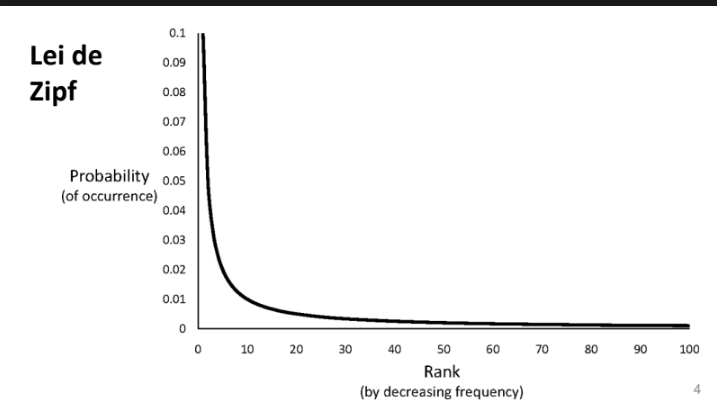

# Lei de Zipf

> Estudo da estatística de ocorrência de palavras em um texto.

> Alguns modelos de linguagem dependem fortemente de propriedades estatísticas das palavras.

---
## Distribuição de Frequências de Palavras

A distribuição de frequências de palavras é muito enviesada:

1. Poucas palavras ocorrem com muita frequência, muitas palavras ocorrem raramente.

2. Exemplo: as duas palavras mais comuns na língua inglesa ("the", "of") correspondem a cerca de **10%** de todas as ocorrências de palavras em documentos textuais.

---
## A Lei de Zipf diz que:

1. O rank (r) de uma palavra, vezes sua frequência (f), é aproximadamente uma constante (k).  
   Ou seja: **f(r) × r ≈ k**

2. Assumindo que palavras são ordenadas em ordem decrescente de frequência, temos:

> Obs.: O rank (r) se refere ao ranking de frequência das palavras. Rank 1, a mais frequente...

> A segunda palavra mais comum aparece metade das vezes da mais comum, a terceira aparece um terço das vezes, e assim por diante.

Matematicamente, dizemos que a frequência de uma palavra em um texto é inversamente proporcional ao seu rank:

**f(r) = 1 / r**

---
## Forma Geral da Lei de Zipf

A fórmula mais completa da Lei de Zipf inclui um expoente `s`, que depende do domínio analisado:

- Para textos, tipicamente `s ≈ 1`
- Esse expoente define o quão "desigual" é a distribuição

---
## Visualização em Escala Log-Log

Se representarmos a frequência vs rank em um gráfico log-log, a distribuição segue aproximadamente uma **linha reta decrescente**:

- Isso indica que a relação é de tipo **potência** (power-law): `f(r) ∝ 1 / r^s`
- Esse tipo de padrão é conhecido como uma **distribuição de cauda longa**

---
## Exemplo Prático

No português, as palavras mais frequentes como "de", "a", "o", "que", seguem essa curva:

- "de" (rank 1) ocorre com frequência altíssima  
- "que" (rank 4) ocorre com cerca de 1/4 da frequência de "de"  
- Palavras como "universidade" (rank 3000+) ainda aparecem, mas com frequência bem baixa

---
## Aplicações da Lei de Zipf

A Lei de Zipf aparece em diversos fenômenos do mundo real:

- **Tamanho de cidades**: poucas cidades muito populosas, muitas pequenas  
- **Acessos a sites**: poucos sites com muito tráfego, muitos com pouco  
- **Popularidade de vídeos, livros, produtos**  
- **Chamadas telefônicas, tamanho de arquivos, etc.**

Esse comportamento é conhecido como **"cauda longa"** — muitos elementos raros que, somados, têm impacto relevante.

---
## Relevância para Modelos de Linguagem

Modelos como GPT, BERT e outros aprendem padrões estatísticos dos textos. A Lei de Zipf afeta diretamente:

- **Distribuição de atenção**: palavras comuns aparecem com mais frequência nos dados de treino  
- **Qualidade das representações**: palavras frequentes têm embeddings mais precisos  
- **Vocabulário truncado**: geralmente só as palavras mais frequentes são incluídas no vocabulário do modelo

➡️ Isso ajuda a entender por que LLMs erram mais com palavras raras ou nomes específicos.

---
## Limitações da Lei de Zipf

- Nem todos os textos seguem **exatamente** a Lei de Zipf  
- Palavras funcionais (como "de", "a", "o") dominam os primeiros ranks  
- Textos muito curtos ou técnicos podem fugir da tendência

Mesmo assim, a Lei de Zipf é uma **boa aproximação estatística** para linguagem natural em larga escala.
