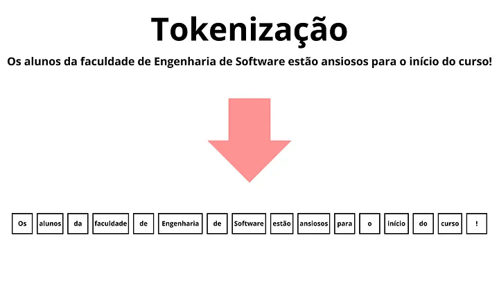
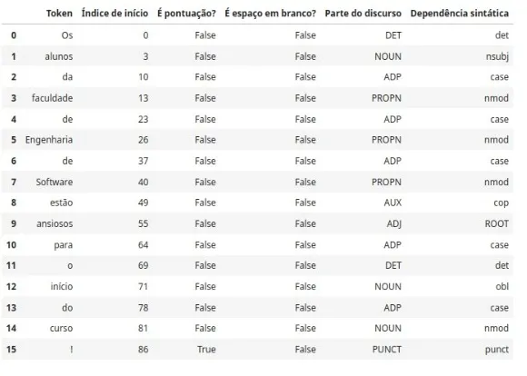

# Pré-Processamento

**Ordem de Pré-Processamento Textual**:

- Eliminar identificadores e URLs usando Expressões Regulares.
- Tokenizar as strings em palavras.
- Remover Stop words e pontuação.
- Stemming vs. Lemmatization.

---
## Tokenização

A tokenização é um processo fundamental no campo do Processamento de Linguagem Natural, onde o texto é transformado em unidades menores chamadas tokens. Esses tokens podem ser palavras individuais, números, pontuações, símbolos especiais ou até mesmo unidades mais complexas, como emojis.

Um token é uma unidade mínima de texto que pode ser tratada como uma única entidade. 

Uma maneira muito simples de tokenizar um texto, é por meio de espaços em branco.



Mesmo que você não vá usar a tokenização baseada em espaço em branco, ela pode ser um primeiro passo antes da Tokenização de fato.

Antes que qualquer modelo de PLN possa processar o texto, ele precisa ser tokenizado para que as palavras e outros elementos possam ser tratados individualmente.

Em alguns casos, a tokenização também pode envolver a normalização do texto, como a conversão de todas as letras para minúsculas, remoção de pontuações ou símbolos especiais, etc.

---
## Como a Tokenização é realizada?

**1. Tokenização baseada em Espaços em Branco**<br>
    Uma abordagem simples é dividir o texto com base nos espaços em branco. Nesta abordagem, cada palavra é tratada como um token separado.

**2. Tokenização com base em Regras**<br>
    Outra abordagem é usar regras específicas para dividir o texto em tokens. Isso pode envolver o uso de expressões regulares (regex) ou outras técnicas para identificar padrões específicos no texto.

**3. Tokenização com base em Subpalavras**<br>
    O texto é dividido em partes menores que, embora possam ser menores que uma palavra inteira, ainda carregam um significado substancial por si mesmas.

**4. Tokenização com base em Modelos de Linguagem**<br>
    Muitas bibliotecas de PLN, como spaCy e NLTK, fornecem modelos de linguagem pré-treinados que são capazes de realizar a tokenização de forma mais precisa e sofisticada.

---
## Tokenização com spacy

```python
!pip install -U spacy
!python -m spacy download pt_core_news_sm

import spacy
import pandas as pd

# Carregando o modelo de idioma em português
nlp = spacy.load('pt_core_news_sm')

# Texto de exemplo
texto = "Os alunos da faculdade de Engenharia de Software estão ansiosos para o início do curso!"

# Aplicando a tokenização
doc = nlp(texto)

# Extraindo os tokens
tokens = [token.text for token in doc]
print("Tokens:", tokens)

# Coletando informações dos tokens em um único DataFrame
dados_tokens = []
for token in doc:
    dados_tokens.append({
        'Token': token.text,
        'Índice de início': token.idx,
        'É pontuação?': token.is_punct,
        'É espaço em branco?': token.is_space,
        'Parte do discurso': token.pos_,
        'Dependência sintática': token.dep_
    })

# Criando DataFrame com os dados dos tokens
df_tokens = pd.DataFrame(dados_tokens)

# Exibindo o DataFrame
df_tokens
```

Output:<br>


---
## Tokenização baseada em Sub-Palavras

O o texto é dividido em partes menores que, embora possam ser menores que uma palavra inteira, ainda carregam um significado substancial por si mesmas.

Por exemplo, vamos tokenizar a palavra “incompreensível” em português. A tokenização baseada em subpalavras poderia dividir essa palavra em várias partes, como “in”, “compreens”, “ível”. Cada uma dessas partes, ou tokens, carrega um significado independente.

Agora, vamos considerar a tokenização de um parágrafo. Suponha que temos o seguinte parágrafo em português:

“O cachorro está correndo no parque. Ele parece muito feliz.”

A tokenização desse parágrafo pode resultar em algo assim:

[“O”, “ c”, “ach”, “or”, “ro”, “ est”, “á”, “ cor”, “rend”, “o”, “no” par”, “que”, “.”, “ Ele”, “ p“, “are”, “ce“, “ m”, “uit“, “o”, “ fel”, “iz”, “.”]


---
## Tokenização baseada em Modelos de Linguagem

```python
pip install transformers

from transformers import AutoTokenizer

# Carregando o tokenizer de um modelo multilíngue
tokenizer = AutoTokenizer.from_pretrained("bert-base-multilingual-cased")

# Texto de exemplo
texto = "O cachorro está correndo no parque. Ele parece muito feliz."

# Tokenizando
tokens = tokenizer.tokenize(texto)
print("Tokens:", tokens)

# Convertendo tokens para IDs (como são representados no modelo)
input_ids = tokenizer.convert_tokens_to_ids(tokens)
print("IDs:", input_ids)
```

---
## Stop Words

Stop words, ou palavras de parada, são palavras comuns em um idioma que geralmente são removidas durante o processamento de texto, seja para análise de texto ou para otimização de mecanismos de busca. Elas não são consideradas essenciais para entender o significado central do texto e podem até atrapalhar a análise ao adicionar ruído. 

Exemplos comuns de stop words incluem:
- Artigos definidos e indefinidos: o, a, os, as, um, uma, uns, umas.
- Preposições: de, em, para, com, por, sobre, etc.
- Conjunções: e, ou, mas, se, etc.
- Pronomes: eu, tu, ele, ela, nós, vós, eles, elas, etc.
- Verbos auxiliares: ser, estar, ter, haver, etc. 

---
## Stemming

É um algoritmo que remove afixos (sufixos e prefixos) de palavras, buscando sua raiz comum. Por exemplo, as palavras "correr", "correndo", "corria" seriam reduzidas a "corr". 

O stemming utiliza regras para identificar e remover sufixos comuns, tentando encontrar a forma base da palavra. Ele não se preocupa com o contexto da palavra na frase ou com sua forma gramatical correta, apenas com a redução morfológica. 

Antes do stemming, os usuários devem tokenizar os dados de texto bruto.

Embora pesquisas evidenciem o papel do stemming na melhoria da precisão de tarefas do PLN, o stemming apresenta dois problemas principais que os usuários precisam observar. Overstemming ocorre quando duas palavras semanticamente distintas são reduzidas à mesma raiz, sendo, assim, confundidas. Understemming ocorre quando duas palavras semanticamente relacionadas não são reduzidas à mesma raiz.

---
## Lematização


---
## Aprofundamento

Para se aprofundar, veja:<br>
[Tokenização Laboratório](../Labs/TokenizacaoNLTK.ipynb)

[Tutorial NLTK](../Labs/Tutorial_NLTK.ipynb)